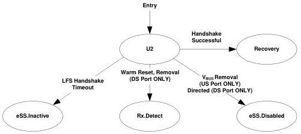

Revision 1.1
June 2022

- 192 -

Universal Serial Bus 3.2
Specification

- When a downstream port is in U2, its upstream port may be in U1 or U2. If the upstream port is in U1, it will send Ping.LFPS periodically. A downstream port shall differentiate between Ping.LFPS and U1 LFPS exit handshake signaling.
- The port shall enable its U2 exit detect functionality as defined in Section 6.9.2. If the port is in x2 operation, it shall enable this functionality on the Configuration Lane.
- The port shall enable its LFPS transmitter when it initiates the exit from U2. If the port is in x2 operation, it shall initiate the exit from U2 on the Configuration Lane.
- A downstream port shall perform the far-end receiver termination detection every 100 ms (tU2RxdetDelay). Note that in x2 operation, a downstream port shall perform the far-end receiver termination detection on the Configuration Lane.

### 7.5.8.2 Exit from U2

- A downstream port shall transition to eSS.Disabled when directed.
- A downstream port shall transition to Rx.Detect upon detection of a far-end high-impedance receiver termination ($Z_{RX-HIGH-IMP-DC-POS}$) defined in Table 6-22.
- A downstream port shall transition to Rx.Detect when directed to issue Warm Reset.
- An upstream port shall transition to Rx.Detect when Warm Reset is detected.
- A self-powered upstream port shall transition to eSS.Disabled upon not detecting valid VBUS as defined in Section 11.4.5.
- The port shall transition to Recovery upon successful completion of a LFPS handshake meeting the U2 LFPS exit signaling defined in Section 6.9.2.
- The port shall transition to eSS.Inactive upon the 2 ms LFPS handshake timer timeout (tNoLFPSResponseTimeout) and a successful LFPS handshake meeting the U2 LFPS exit handshake signaling in Section 6.9.2 is not achieved.

Figure 7-23. U2

Note: Transition conditions are illustrative only, Not all of the transition conditions are listed.

### 7.5.9 U3

U3 is a link state where a device is put into a suspend state. Significant link and device powers are saved.

Copyright © 2022 USB 3.0 Promoter Group. All rights reserved.