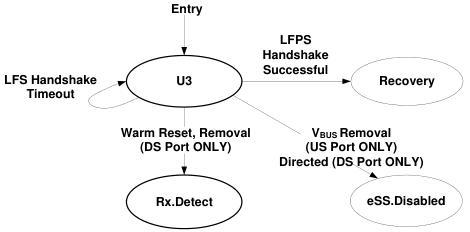

Revision 1.1
June 2022

- 194 -

Universal Serial Bus 3.2
Specification

Figure 7-24. U3

Note: Transition conditions are illustrative only, Not all of the transition conditions are listed.

### 7.5.10 Recovery

The Recovery link state is entered to retrain the link, or to perform Hot Reset, or to switch to Loopback mode. In order to retrain the link and also minimize the recovery latency, the two link partners do not train the receiver equalizers. Instead, the last trained equalizer configurations are maintained. Only TS1 and TS2 ordered sets are transmitted to synchronize the link and to exchange the link configuration information defined in Table 6-6.

#### 7.5.10.1 Recovery Substate Machines

Recovery contains a substate machine shown in Figure 7-25 with the following substates:

- Recovery.Active
- Recovery.Configuration
- Recovery.Idle

#### 7.5.10.2 Recovery Requirements

- The port shall meet the transmitter specifications as defined in Table 6-18.
- The port shall maintain the low-impedance receiver termination (R_RX-DC) as defined in Table 6-22.
- For SuperSpeed USB, all header packets in the Tx Header Buffers and the Rx Header Buffers shall be handled based on the requirements specified in Section 7.2.4.
- For SuperSpeedPlus USB, all header packets and data packet headers in the Type 1/Type 2 Tx Header Buffers and the Type 1/Type 2 Rx Buffers shall be handled based on the requirements specified in Section 7.2.4.

#### 7.5.10.3 Recovery.Active

Recovery.Active is a substate to train the Enhanced SuperSpeed link by transmitting the TS1 ordered sets.

Copyright © 2022 USB 3.0 Promoter Group. All rights reserved.