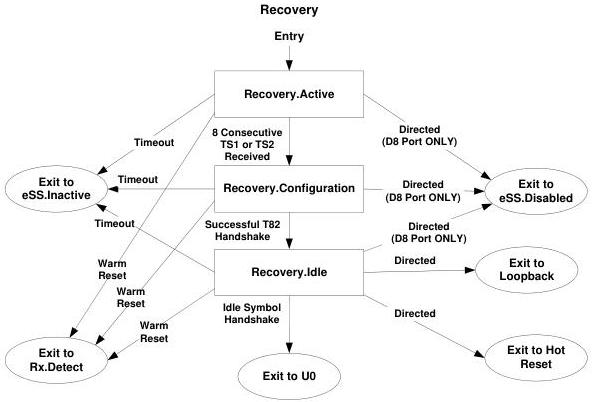

Revision 1.1
June 2022

- 199 -

Universal Serial Bus 3.2
Specification

Figure 7-25. Recovery Substate Machine

Note: Transition conditions are illustrative only. Not all transition conditions are listed.

### 7.5.11 Loopback

Loopback is intended for the receiver test and fault isolation. Loopback includes an optional bit error rate test (BERT) state machine in Gen 1 operation, described in Section 0.

Loopback is also used for the BLR transmitter compliance test in Gen 1x1 operation. Refer to Section E.3.6 for the test configuration of BLR Compliance Mode.

A loopback master is the port requesting loopback. A loopback slave is the port that retransmits the symbols received from the loopback master.

During Loopback.Active, the loopback slave may support the BERT protocol described in Section 0. The loopback slave may respond to the command for BERT error counter reset and BERT report error count. The loopback slave may check the incoming data for the loopback data pattern.

#### 7.5.11.1 Loopback Substate Machines

Loopback contains a substate machine shown in Figure 7-26 with the following substates:

- Loopback.Active
- Loopback.Exit

Copyright © 2022 USB 3.0 Promoter Group. All rights reserved.