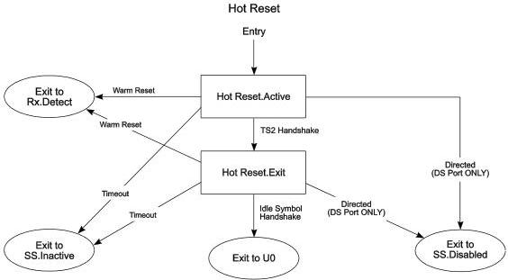

Revision 1.1

June 2022

- 205 -

Universal Serial Bus 3.2

Specification

Figure 7-27. Hot Reset Substate Machine

Note: Transition conditions are illustrative only. Not all of the transition conditions are listed.

Copyright © 2022 USB 3.0 Promoter Group. All rights reserved.