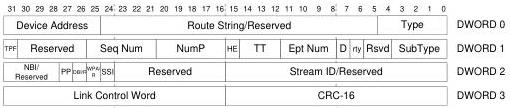

Revision 1.1
June 2022

- 209 -

Universal Serial Bus 3.2
Specification

All packets consist of a 14-byte header, followed by a 2-byte Link Control Word at the end of the packet (16 bytes total). All headers have a Type field that is used by the receiving entity (e.g., host, hub, or device) to determine how to process the packet. All headers include a 2-byte CRC (CRC-16).

All devices (including hubs) and the host consume the LMPs they receive.

If the value of the Type field is Transaction Packet or Data Packet Header, the Route String and Device Address fields follow the Type field. The Route String field is used by hubs to route packets which appear on their upstream port to the appropriate downstream port. Packets flowing from a device to the host are always routed from a downstream port on a hub to its upstream port. The Device Address field is provided to the host so that it can identify the source of a packet. All other fields are discussed further in this chapter.

Figure 8-2. Example Transaction Packet

Data Packets include additional information in the header that describes the data block. The Data Block is always followed by a 4-byte CRC-32 used to determine the correctness of the data. The Data Block and the CRC-32 together are referred to as the Data Packet Payload.

### 8.3 Packet Formats

Packet byte and bit definitions in this section are described in an un-encoded data format. The effects of symbols added to the serial stream (i.e., to frame packets or control or modify the link), bit encoding, bit scrambling, and link level framing have been removed for the sake of clarity. Refer to Chapters 6 and 7 for detailed information.

#### 8.3.1 Fields Common to all Headers

All Enhanced SuperSpeed headers start with the Type field that is used to determine how to interpret the packet. At a high level this tells the recipient of the packet what to do with it: either to use it to manage the link or to move and control the flow of data between a device and the host.

##### 8.3.1.1 Reserved Values and Reserved Field Handling

Reserved fields and Reserved values shall not be used in a vendor-specific manner.

A transmitter shall set all Reserved fields to zero and a receiver shall ignore any Reserved field.

A transmitter shall not set a defined field to a reserved value and a receiver shall ignore any packet that has any of its defined fields set to a reserved value. Note that the receiver shall acknowledge the packet and return credit for the same as per the requirement specified in Section 7.2.4.1.

Note: SuperSpeedPlus hosts, hubs and devices use some fields previously marked as Reserved.

Copyright © 2022 USB 3.0 Promoter Group. All rights reserved.