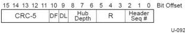

Revision 1.1
June 2022

- 210 -

Universal Serial Bus 3.2
Specification

### 8.3.1.2 Type Field

The Type field is a 5-bit field that identifies the format of the packet. The type is used to determine how the packet is to be used or forwarded by intervening links.

Table 8-1. Type Field Description

[tbl-96.md](tbl-96.md)

### 8.3.1.3 CRC-16

All header packets have a 16-bit CRC field. This field is the CRC calculated over the preceding 12 bytes in the header packet. Refer to Section 7.2.1.1.2 for the polynomial used to calculate this value.

### 8.3.1.4 Link Control Word

The usage of the Link Control Word is defined in Section 7.2.1.1.3.

Figure 8-3. Link Control Word Detail

Table 8-2. Link Control Word Format

[tbl-97.md](tbl-97.md)

Copyright © 2022 USB 3.0 Promoter Group. All rights reserved.