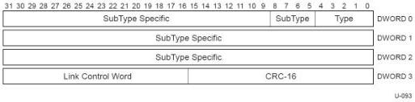

Revision 1.1
June 2022

- 211 -

Universal Serial Bus 3.2
Specification

[tbl-98.md](tbl-98.md)

### 8.4 Link Management Packet (LMP)

Packets that have the **Type** field set to *Link Management Packet* are referred to as LMPs. These packets are used to manage a single link. They carry no addressing information and as such are not routable. They may be generated as the result of hub port commands. For example, a hub port command is used to set the U2 inactivity timeout. In addition, they are used to exchange port capability information and may be used for testing purposes.

Figure 8-4. Link Management Packet Structure

### 8.4.1 Subtype Field

The value in the LMP **Subtype** field further identifies the content of the LMP.

Table 8-3. Link Management Packet Subtype Field

[tbl-99.md](tbl-99.md)

Copyright © 2022 USB 3.0 Promoter Group. All rights reserved.