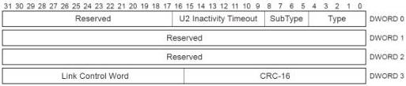
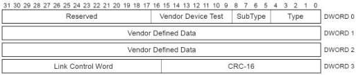

Revision 1.1
June 2022

- 213 -

Universal Serial Bus 3.2
Specification

### 8.4.3 U2 Inactivity Timeout

The U2 Inactivity Timeout LMP shall be used to define the timeout from U1 to U2. Refer to Section 10.6 for details on this LMP.

Figure 8-6. U2 Inactivity Timeout LMP

U-095

Table 8-5. U2 Inactivity Timer Functionality

[tbl-101.md](tbl-101.md)

### 8.4.4 Vendor Device Test

Use of this LMP is intended for vendor-specific device testing and shall not be used during normal operation of the link.

Figure 8-7. Vendor Device Test LMP

U-096

Table 8-6. Vendor-specific Device Test Function

[tbl-102.md](tbl-102.md)

Copyright © 2022 USB 3.0 Promoter Group. All rights reserved.