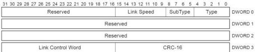

Revision 1.1
June 2022

- 216 -

Universal Serial Bus 3.2
Specification

Figure 8-9. Port Configuration LMP

U-098

Table 8-9. Port Configuration LMP Format (Differences with Port Capability LMP)

[tbl-106.md](tbl-106.md)

A port configured in the downstream mode shall send the Port Configuration LMP to the upstream port. The port sending this LMP shall select only one bit for the **Link Speed** field. The **Link Speed** field shall only be used when the port is operating at Gen 1x1 speed.

If a downstream capable port cannot work with its link partner, then the downstream capable port shall signal an error as described in Section 10.16.2.6.

### 8.4.7 Port Configuration Response

This LMP is sent by the upstream port in response to a Port Configuration. It is used to indicate acceptance or rejection of the Port Configuration LMP. Only the fields that are different from the Port Capability LMP are described in this section.

All Enhanced SuperSpeed ports that support upstream port capability shall be capable of sending this LMP.

If the downstream port does not receive this LMP within tPortConfiguration time, it shall signal an error as described in Section 10.16.2.6.

Copyright © 2022 USB 3.0 Promoter Group. All rights reserved.