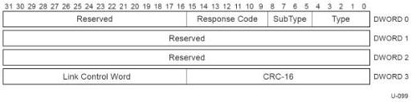

Revision 1.1
June 2022

- 217 -

Universal Serial Bus 3.2
Specification

Figure 8-10. Port Configuration Response LMP

Table 8-10. Port Configuration Response LMP Format (Differences with Port Capability LMP)

[tbl-107.md](tbl-107.md)

If the Response Code indicates that the Link Speed was rejected by the upstream port, the downstream port shall signal an error as described in Section 10.16.2.6.

### 8.4.8 Precision Time Measurement

PTM enables USB devices to have more precise notion of time by providing a method of precisely characterizing link delays, and the propagation delays through a hub. The PTM capability is discovered by software through the PTM Capability Descriptor described in Section 9.6.2.6.

Precision Time Measurement consists of two separate mechanisms: Link Delay Measurement (LDM) and Hub Delay Measurement (HDM). These mechanisms complement each other to provide highly accurate bus interval boundary timing for devices; however, HDM may be used to improve device bus interval boundary timing accuracy even if LDM timing information is not available.

SuperSpeedPlus hosts and hubs shall support PTM. PTM support is optional normative for all peripheral devices and SuperSpeed only hosts and hubs. Ideally, PTM is supported by all components of a USB topology; however, PTM capable hubs will still improve the overall accuracy of a device's notion of the bus interval boundary timing.

#### 8.4.8.1 PTM Bus Interval Boundary Counters

A bus interval boundary shall be defined as a pair of counters, referred to as the PTM Bus Interval Boundary Counters, that use a format similar to the 27-bit Isochronous Timestamp of an ITP:

Copyright © 2022 USB 3.0 Promoter Group. All rights reserved.