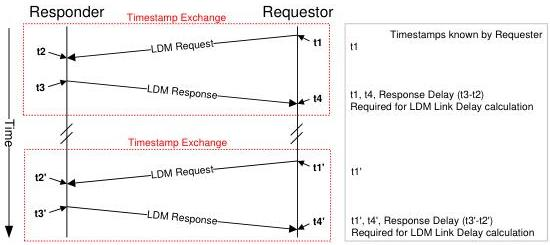

Revision 1.1
June 2022

- 218 -

Universal Serial Bus 3.2
Specification

- PTM Delta Counter, 13 bits.
- PTM Bus Interval Counter, 14 bits.

The PTM Clock has a period of tIsochTimestampGranularity units.

The PTM Delta Counter shall be incremented by the PTM Clock to measure the delay from present time to the previous bus interval boundary. The PTM Delta Counter is a modulus 7500 counter, wrapping on microframe boundaries, i.e. incrementing from 0 to 7499 (~125 μs), then wrapping back to 0.

The PTM Bus Interval Counter shall be incremented when the PTM Delta Counter wraps. The PTM Bus Interval Counter is a modulus 16k counter, i.e. incrementing from 0 to 16,383, then wrapping back to 0.

The time synchronization mechanism within the device of the PTM Clock to the bus interval boundary is implementation-specific.

Hosts shall implement a set of PTM Bus Interval Boundary Counters. The host is the source of the bus interval boundary for a PTM Domain.

Hubs are not required to implement PTM Bus Interval Boundary Counters.

PTM capable devices shall implement PTM Bus Interval Boundary Counters.

### 8.4.8.2 LDM Protocol

The LDM protocol is executed with a series of Exchanges between a Requester and a Responder, and ITPs transmitted by Responders to measure the LDM Link Delay illustrates the LDM Timestamp Exchanges.

The following rules apply to LDM Requesters and Responders:

- A LDM Requester is an upstream facing port.
- A LDM Responder is a downstream facing port.
- A LDM Requester and a LDM Responder are paired on a USB link.

Figure 8-11. Link Delay Measurement Protocol

Copyright © 2022 USB 3.0 Promoter Group. All rights reserved.