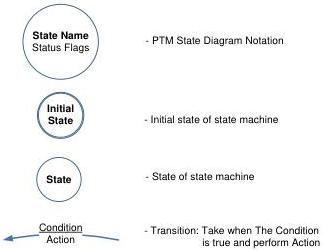

Revision 1.1
June 2022

- 220 -

Universal Serial Bus 3.2
Specification

recorded timestamps for t1 and t4, and received Response Delay from the Responder. Refer to Section 8.4.8.3 for how these timestamps are used to compute the LDM Link Delay.

### 8.4.8.2.2 PTM ITP Transfer

Once a LDM Timestamp Exchange is complete, the Link Delay may be computed and PTM may be applied by a Requester to received ITPs. A PTM ITP Transfer consists of an ITP being generated by a LDM Responder and being received by a LDM Requester.

As illustrated in Figure 8-19, the timestamps tITDFP and tITUFP are recorded by the Requester and Responder.

At time tITUFP in a PTM ITP Transfer a LDM Requester has all the information that it needs to compute the bus interval boundary. In the example of Figure 8-12, at time tITUFP the Requester has recorded timestamp for tITUFP and received timestamp tITDFP (encoded in the Isochronous Timestamp and Correction fields of an ITP) from the Responder. Refer to Section 8.4.8.4 for how these timestamps are used to compute the bus interval boundary.

### 8.4.8.3 LDM State Machines

The LDM state machines utilize the following notation:

Figure 8-13. LDM State Machine Notation

Where the State Name is an informative name defined for the state, the Status Flags values are:

LDM Enabled and LDM Valid, respectively, e.g. the Status Flags value 0,0 is interpreted as LDM Enabled = false (0) and LDM Valid = false (0).

Note: Transitions associated with a large bubble may occur from any state defined within the bubble as long as the Conditions match.

Note: The figures in this section are provided to illustrate state transition conditions and actions; however, refer to the textual descriptions of the respective states in the sections below for their explicit definition.

Copyright © 2022 USB 3.0 Promoter Group. All rights reserved.