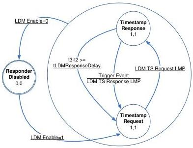

Revision 1.1
June 2022

- 223 -

Universal Serial Bus 3.2
Specification

LDM TS Response LMP & DL=1 – If a LDM TS Response LMP is received and the LCW Delayed (DL) flag is one, the Requester shall consider the Response Delay field of the LDM TS Response LMP invalid, invalidate the LDM Context t1, t2, t3 timestamps, immediately generate a Trigger Event to initiate another Timestamp Exchange, and transition to the Timestamp Request state. Refer to Sections 7.2.4.1.2 and 7.2.4.1.12 for the conditions that may set the Delayed bit.

Response Timeout – If a Response Timeout occurs the Requester shall transition to the Init Request state, where the LDM state machine will attempt to retry the Timestamp Exchange with the Responder.

Note: Timestamp t4 shall be adjusted for the TS Delay. Refer to Section 8.4.8.6 for more information.

### 8.4.8.3.1.5 LDM Disabled

Upon entering this state, the Requester shall clear the LDM_ENABLE flag and terminate all LDM protocol activity.

CLEAR_FEATURE(LDM_ENABLE) – When this request is received by the device it shall transition from any other LDM state to the LDM Disabled state.

SET_FEATURE(LDM_ENABLE) – If this request is received by the device it shall transition to the Init Request state.

### 8.4.8.3.2 Responder Operation

This section describes the operations that a Responder (i.e. the Downstream Facing Port of a hub or host controller) performs to participate in the LDM protocol.

Figure 8-15. LDM Responder State Machine

The LDM Responder State Machine shall maintain the following local variable: Responder Response Delay Overflow.

Copyright © 2022 USB 3.0 Promoter Group. All rights reserved.