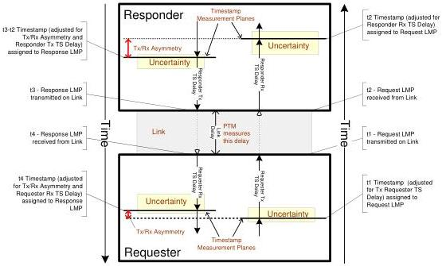

Revision 1.1
June 2022

- 228 -

Universal Serial Bus 3.2
Specification

Figure 8-16. PTM Path Performance Contributors

The following requirements should be met to achieve optimal propagation delay measurement:

- The Link Delay between Requester and Responder should be symmetric.
- Timestamp values are assigned to ITPs and TS LMPs to capture when the packet was actually received or transmitted on the Link. LDM timestamp values are also captured in ITPs (Bus Interval Counter/Delta fields) and TS Response LMPs (Response Delay) when they are transmitted.
- An implementation dependent TS Delay occurs between assigning Timestamp values to an ITP, or LDM LMP, and the packet actually being received or transmitted on the Link. Each Timestamp value should be adjusted for the respective TS Delay so that the Timestamp captured for a LDM LMP or ITP approximates the actual time that the last symbol of the respective packet crosses the boundary between a Requester or Responder and the Link.
- A port may contain asymmetric delays in its timestamp mechanism or protocol path (e.g. Rx/Tx Asymmetry). If these asymmetries are not negligible:

1. The Responder shall adjust the TS Response LMP Response Delay (t3-t2 Timestamp) value appropriately for its Rx/Tx Asymmetry, such that its t2 and t3 Timestamps appear to have been captured at equal TS Delays from the Link boundary.
2. The Requester shall account for its Rx/Tx Asymmetry when computing the t4 Timestamp.

- The Link Delay between Requester and Responder should be constant over the time interval between LDM Request and Response LMPs.
- The worst case delay fluctuation (Uncertainty) of timestamps shall be bounded by tPropagationDelayJitterLimit.

Copyright © 2022 USB 3.0 Promoter Group. All rights reserved.