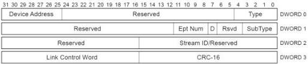
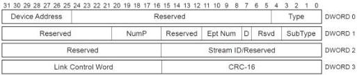

Revision 1.1
June 2022

- 235 -

Universal Serial Bus 3.2
Specification

Figure 8-19. NRDY Transaction Packet

Table 8-14. NRDY TP Format (Differences with ACK TP)

[tbl-113.md](tbl-113.md)

### 8.5.3 Endpoint Ready (ERDY) Transaction Packet

This TP can only be sent by a device for a non-isochronous endpoint. It is used to inform the host that an endpoint is ready to send or receive data packets. Only the fields that are different from an ACK TP are described in this section.

Figure 8-20. ERDY Transaction Packet

Table 8-15. ERDY TP Format (Differences with ACK TP)

[tbl-114.md](tbl-114.md)

Copyright © 2022 USB 3.0 Promoter Group. All rights reserved.