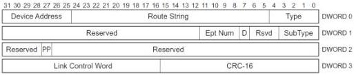
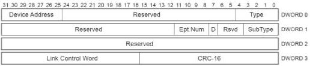

Revision 1.1
June 2022

- 236 -

Universal Serial Bus 3.2
Specification

[tbl-115.md](tbl-115.md)

### 8.5.4 STATUS Transaction Packet

This TP can only be sent by the host. It is used to inform a control endpoint that the host has initiated the Status stage of a control transfer. This TP shall only be sent to a control endpoint. Only the fields that are different from an ACK TP are described in this section.

Figure 8-21. STATUS Transaction Packet

Table 8-16. STATUS TP Format (Differences with ACK TP)

[tbl-116.md](tbl-116.md)

### 8.5.5 STALL Transaction Packet

This TP can only be sent by an endpoint on the device. It is used to inform the host that the endpoint is halted or that a control transfer is invalid. Only the fields that are different from an ACK TP are described in this section.

Figure 8-22. STALL Transaction Packet

Copyright © 2022 USB 3.0 Promoter Group. All rights reserved.