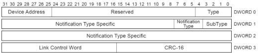

Revision 1.1
June 2022

- 237 -

Universal Serial Bus 3.2
Specification

Table 8-17. STALL TP Format (Differences with ACK TP)

[tbl-117.md](tbl-117.md)

### 8.5.6 Device Notification (DEV_NOTIFICATION) Transaction Packet

This TP can only be sent by a device. It is used by devices to inform the host of an asynchronous change in a device or interface state, e.g., to identify the function within a device that caused the device to perform a remote wake operation. This TP is not sent from a particular endpoint but from the device in general. Only the fields that are different from an ACK TP are described in this section.

Figure 8-23. Device Notification Transaction Packet

Table 8-18. Device Notification TP Format (Differences with ACK TP)

[tbl-118.md](tbl-118.md)

Notes:

1. This Notification Type value shall be reserved for OTG use. Refer to Section 5.5 of the USB 3.0 OTG and EH Supplement for the definition of the respective Device Notification TP.

2. This Device Notification is required for devices operating in SuperSpeedPlus mode. This Device Notification is optional for devices operating in SuperSpeed mode.

Copyright © 2022 USB 3.0 Promoter Group. All rights reserved.