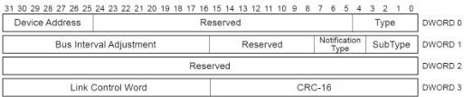

Revision 1.1
June 2022

- 239 -

Universal Serial Bus 3.2
Specification

[tbl-123.md](tbl-123.md)

### 8.5.6.3 Bus Interval Adjustment Message Device Notification

The Bus Interval Adjustment Message Device Notification is deprecated.

Figure 8-26. Bus Interval Adjustment Message Device Notification

Table 8-21. Bus Interval Adjustment Message Device Notification

[tbl-124.md](tbl-124.md)

### 8.5.6.4 Function Wake Notification

A function may signal that it wants to exit from device suspend (after transitioning the link to U0) or function suspend by sending a Function Wake Device Notification to the host if it is enabled for remote wakeup. Refer to Section 9.2.5 for more details.

### 8.5.6.5 Latency Tolerance Messaging

Latency Tolerance Messaging is an optional normative USB power management feature that utilizes reported BELT (Best Effort Latency Tolerance) values to enable more power efficient platform operation.

Copyright © 2022 USB 3.0 Promoter Group. All rights reserved.