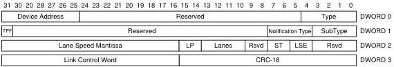

Revision 1.1
June 2022

- 242 -

Universal Serial Bus 3.2
Specification

The even distribution and average adjustment requirements for bus interval adjustments shall apply from one bus interval after a bus interval adjustment request is received by the host until the bus interval where a subsequent valid bus interval adjustment request is received by the host.

The following is an example of valid host behavior for a specific bus interval adjustment request. After power on, the host receives a bus interval adjustment request for a bus interval decrease of 10 BusIntervalAdjustmentGranularity units in bus interval X-1. The host controller uses a clock with a period of eight high speed bit times to drive a counter that produces timestamps and bus interval boundaries. The host controller adds an extra eight high speed bit time clock tick to its counter in each of the following bus intervals: X+409, X+819, X+1228, X+1638, X+2048, X+2457, X+2867, X+3276, X+3686, X+4096, X+4505,...

### 8.5.6.7 Sublink Speed Device Notification

Sublink Speed Device Notification TPs are reported by the device to identify the characteristics of its link connection. Sublink Speed Device Notification TPs shall be generated by Enhanced SuperSpeed devices operating in SuperSpeedPlus mode upon entering the Address USB Device State.

Lane Speed = Lane Speed Mantissa * 1000$^{Lane Speed Exponent}$

Sublink Speed = Lane Speed * (Lane Count + 1)

- The device shall inform the host that a Device Notification TP shall follow a SET_ADDRESS request by setting the TP Follows (TPF) flag in the Status stage ACK TP.
- The Rx Sublink Speed Device Notification TP shall be the next TP transmitted by a device after setting the TP Follows (TPF) flag in a Status stage ACK TP.
- The device shall inform the host that a second Device Notification TP shall follow the Rx Sublink Speed Device Notification TP by setting the TP Follows (TPF) flag in the Rx Sublink Speed Device Notification TP.
- The Tx Sublink Speed Device Notification TP shall be the next TP transmitted by a device after setting the TP Follows (TPF) flag in the Rx Sublink Speed Device Notification TP.

Asymmetric Lane Types may only be reported by SuperSpeed Interchip (SSIC) devices. A Symmetric link is one that has the same Lane Speed and number of lanes for both the Rx and Tx Sublinks. Enhanced SuperSpeed devices shall only support Symmetric links.

Figure 8-27. Sublink Speed Device Notification

Copyright © 2022 USB 3.0 Promoter Group. All rights reserved.