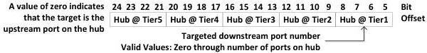

Revision 1.1
June 2022

- 249 -

Universal Serial Bus 3.2
Specification

Figure 8-32. Route String Detail

In Figure 8-32, the value in Hub@Tier1 field is the downstream port number of the hub connected directly to one of the root ports on the host to which a second hub is attached and so on.

#### 8.9.1 Route String Port Field

This 4-bit wide field in the Route String represents the port in the hub being addressed.

#### 8.9.2 Route String Port Field Width

The Route String Port field width is fixed at 4 bits, limiting the maximum number of ports a hub may support to 15.

#### 8.9.3 Port Number

The specific port on a hub to which the packet is directed is identified by the value in the Route String Port field. When addressing the hub controller then the Port Number field at the hub's tier level shall be set to zero in the Route String. The hub's downstream ports are addressed beginning with one and count up sequentially.

### 8.10 Transaction Packet Usages

TPs are used to report the status of data transactions and can return values indicating successful reception of data packets, command acceptance or rejection, flow control, and halt conditions.

#### 8.10.1 Flow Control Conditions

This section describes the interaction between the host and a device when an endpoint returns a flow control response. The flow control is at an end-to-end level between the host and the endpoint on the device. Only bulk, control and interrupt endpoints may send flow control responses. Isochronous endpoints shall not send flow control responses.

An IN endpoint shall be considered to be in a flow control condition if it returns one of the following responses to an ACK TP:

- Responding with an NRDY TP; note that an endpoint shall wait until it receives an ACK TP for the last DP it transmitted before it can send an NRDY TP
- Sending a DP with the EOB field set to 1 in the DPH

An OUT endpoint shall be considered to be in a flow control condition if it returns one of the following responses to a DP:

- Responding with an NRDY TP
- Sending an ACK TP with the NumP field set to 0

The Packets Pending field is only valid when set by the host and does not affect whether or not an endpoint enters the flow control state. Refer to Section 8.11 for further details on host and device TP responses.

Copyright © 2022 USB 3.0 Promoter Group. All rights reserved.