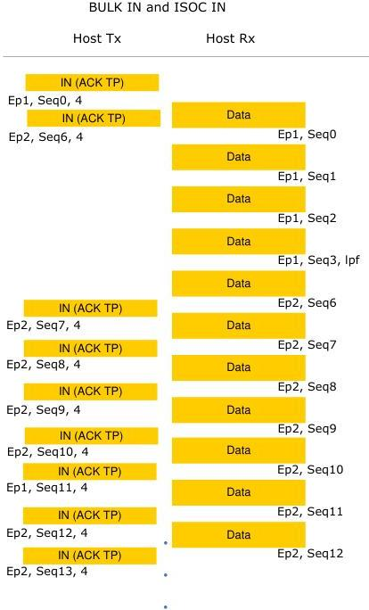

Revision 1.1
June 2022

- 254 -

Universal Serial Bus 3.2
Specification

**Figure 8-34. Sample Concurrent BULK and Isochronous IN Transactions**

**8.11 TP or DP Responses**

Transmitting and receiving devices shall return DPs or TPs as detailed in Table 8-27 through Table 8-29. Not all TPs are allowed, depending on the transfer type and depending on the direction of flow of the TP.

Copyright © 2022 USB 3.0 Promoter Group. All rights reserved.