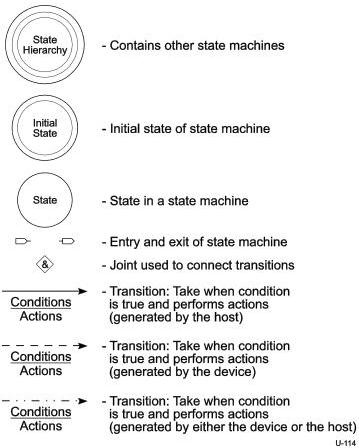

Revision 1.1
June 2022

- 259 -

Universal Serial Bus 3.2
Specification

A transition is labeled with a block with a line in the middle separating the (upper) condition and the (lower) actions. A transition without a line is a condition only. The condition is required to be true to take the transition. The actions are performed if the transition is taken. The syntax for actions and conditions is VHDL. A circle includes a name in bold and optionally one or more actions that are performed upon entry to the state.

Transitions using a solid arrow are generated by the host. Transitions using a dashed arrow are generated by a device. Transitions using a dot-dot-dash arrow are generated by the either a device or the host.

Figure 8-35. Legend for State Machines

### 8.12.1.2 Bulk IN Transactions

When the host is ready to receive bulk data, it sends an ACK TP to a device indicating the sequence number and number of packets it expects from the device. A Bulk endpoint shall respond as defined in Section 8.11.1.

The host shall send an ACK TP for each valid DP it receives from a device. A device does not need to wait for the ACK TP to send the next DP to the host if the previous ACK TP indicated that the host expected the device to send more than one DP (depending on the value of the Number of Packets field in the TP). The ACK TP implicitly acknowledges the last DP with the previous sequence number as being successfully received by the host and also indicates to the device the next DP with the sequence number and number of packets the host expects from the device. If the host detects an error while receiving any of the DPs, it shall send an

Copyright © 2022 USB 3.0 Promoter Group. All rights reserved.