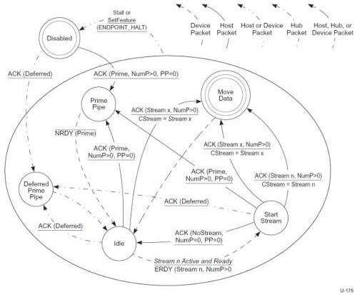

Revision 1.1
June 2022

- 266 -

Universal Serial Bus 3.2
Specification

Note: A transition condition that is italicized shall be interpreted as a comment, not a required condition. For example, the "Stream n Active and Ready" text of the Idle to Start Stream transition of Figure 8-39.

Note: Any CStream data payload may be zero-length. The use of zero-length DPs on a Stream pipe (other than for Prime Pipe or Start Stream reject operations) is defined by the Device Class associated with the endpoint.

Note: An IN Data or Burst Transaction is terminated with an ACK TP with NumP = 0. This ACK TP is referred to as a "Terminating ACK" in the following sections.

### 8.12.1.4.2 Device IN Stream Protocol

This section defines the Enhanced SuperSpeed packet exchanges that transition the device side of the Stream Protocol from one state to another on an IN bulk endpoint.

In the following text, a Device IN Stream state transition is assumed to occur at the point the device sends the first bit of the first symbol of a state machine related message to the host, or at the point the device first decodes state machine related message from the host.

For an IN pipe, Endpoint Buffers in the host receive Function Data from a device.

Figure 8-39. Device IN Stream Protocol State Machine (DISPSM)

### 8.12.1.4.2.1 Disabled

After an endpoint is configured or receives a SetFeature(ENDPOINT_HALT) request, the pipe is in the Disabled state.

Copyright © 2022 USB 3.0 Promoter Group. All rights reserved.