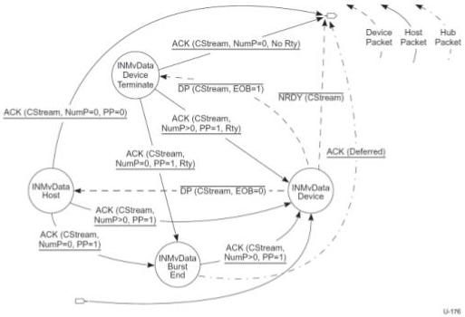

Revision 1.1
June 2022

- 269 -

Universal Serial Bus 3.2
Specification

Figure 8-40. Device IN Move Data State Machine (DIMDSM)

The Device IN Move Data State Machine (DIMDSM) is entered from the Start Stream or Idle states as described above. The entry into the DIMDSM immediately transitions to the INMvData Device state. The DIMDSM allows either the device to terminate the Move Data operation because it has exhausted its Function Data associated with a Stream or the host to terminate the Move Data operation because it has exhausted its Endpoint Buffer space associated with a Stream.

The DIMDSM always exits to the Idle state. The Retry (Rty=1) flag shall never be set in a packet that causes a DIMDSM exit. A Stream pipe remains in the Move Data state during packet retries.

Note: The Stream ID value shall be CStream for all packets exchanged in the Move Data state. If a Stream ID value other than CStream is detected while in the DIMDSM, the device should halt the endpoint.

Note: if CStream is not Active upon initially entering the Move Data state, the device may reject the Stream proposal with an NRDY or STALL the pipe, as defined by the associated Device Class.

### 8.12.1.4.2.7 INMvData Device

This state is initially entered from the Start Stream state or the Idle state. In this state the device prepares a DP to send to the host or may reject a HIMD from the host.

DP(CStream, EOB=0) - If the device's Endpoint Data for CStream is greater than one Max Packet Size, then the device may send a DP to the host with EOB = 0 and transition to the INMvData Host state. The DPP shall contain CStream data.

Copyright © 2022 USB 3.0 Promoter Group. All rights reserved.