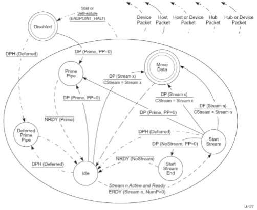

Revision 1.1
June 2022

- 272 -

Universal Serial Bus 3.2
Specification

Figure 8-41. Device OUT Stream Protocol State Machine (DOSPSM)

### 8.12.1.4.3.1 Disabled

After an endpoint is configured or receives a SetFeature(ENDPOINT_HALT) request, the pipe is in the Disabled state.

DP(Prime, PP=0) - If a DP with the Stream ID field set to Prime is successfully received, then the device shall transition the pipe to the Prime Pipe state. The DPP shall contain a zero-length data payload. This transition occurs after the initial Endpoint Buffers are assigned to the pipe by system software. Note, if an error is detected in the DP data (even though it is zero-length) the device shall remain in the Disabled state, and issue ACK(Prime, NumP>0, Rty) packets, retrying until a DP(Prime) is successfully received. This case is not illustrated in the figure above.

DPH(Deferred) - If a DP with the Deferred (DF) flag set is received, then the device shall transition the pipe to the Deferred Prime Pipe state. This packet is received when the link has transitioned to a U1 or U2 state while waiting for the initial Endpoint Data assignment.

### 8.12.1.4.3.2 Prime Pipe

The Prime Pipe state informs the device that the Endpoint Data has been assigned to one or more Streams; however, it does not specify which Stream(s). After returning to the Idle state the device shall issue an ERDY to start a specific Stream from its list of Active and Ready Streams.

NRDY(Prime) - Upon entering the Prime Pipe state, the device shall return an NRDY TP with its Stream ID field set to Prime and immediately transition to the Idle state.

Copyright © 2022 USB 3.0 Promoter Group. All rights reserved.