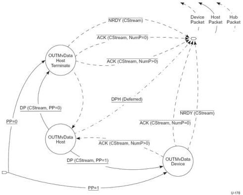

Revision 1.1
June 2022

- 275 -

Universal Serial Bus 3.2
Specification

Figure 8-42. Device OUT Move Data State Machine (DOMDSM)

The Device OUT Move Data State Machine (DOMDSM) is entered from the Start Stream or Idle states as described above.

The DOMDSM allows either the device to terminate the Move Data operation because it has exhausted its Function Buffer space associated with a Stream or the host to terminate the Move Data operation because it has exhausted its Endpoint Data associated with a Stream.

PP=0 - Upon entry into the DOMDSM, if the host has only one packet of Endpoint Data available for the Stream then PP will equal 0 in the first DP received by the Device, and it shall transition to the OUTMvData Device Terminate state.

PP = 1 - Upon entry into the DOMDSM, if the host has more than one packet of Endpoint Data available for the Stream then PP will equal 1 in the first DP received by the Device, and it shall transition to the OUTMvData Device state.

The DOMDSM always exits to the Idle state. The Retry (Rty=1) flag shall never be set in a packet that causes a DOMDSM exit. A Stream pipe remains in the Move Data state during packet retries.

Note: The Stream ID value shall be CStream for all packets exchanged in the Move Data state. If a Stream ID value other than CStream is detected while in the DOMDSM the device should halt the endpoint.

Note: if CStream is not Active upon initially entering the Move Data state, the device may reject the Stream proposal with an NRDY or STALL the pipe, as defined by the associated Device Class.

Copyright © 2022 USB 3.0 Promoter Group. All rights reserved.