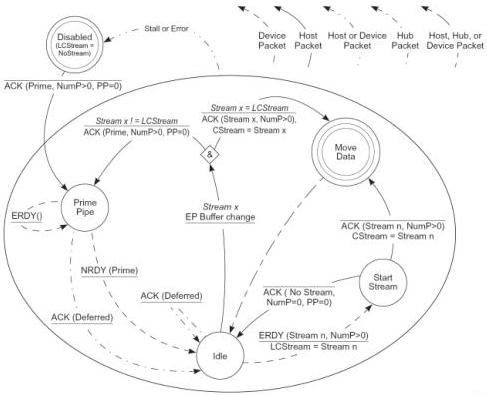

Revision 1.1
June 2022

- 277 -

Universal Serial Bus 3.2
Specification

ACK(CStream, NumP>0) - If the device has not exhausted its Function Buffer space, then it shall generate an ACK TP with NumP > 0, and transition to the Idle state, exiting the DOMDSM. The device shall set CStream to Not Ready due to this transition.

ACK(CStream, NumP>0, Rty) - If an error was detected on the last DP by the device, then it shall generate an ACK TP with NumP > 0 and Rty = 1, so that the host will retry the last DP. The device shall then transition to the OUTMvData Host state.

NRDY(CStream) - The device may flow control on the last CStream transfer by sending an NRDY with its Stream ID set to CStream and transition to the Idle state, exiting the DOMDSM. The device may generate this transition due to unexpected internal conditions where it wants to flow control CStream.

### 8.12.1.4.4 Host IN Stream Protocol

This section defines the Enhanced SuperSpeed packet exchanges that transition the host side of the Stream Protocol from one state to another on an IN bulk endpoint.

In the following text, a Host IN Stream state transition is assumed to occur at the point the host sends the first bit of the first symbol of a state machine related message to the device, or at the point the host first decodes state machine related message from the device.

For an IN pipe, Endpoint Buffers in the host receive Function Data from a device.

Figure 8-43. Host IN Stream Protocol State Machine (HISPSM)

U-179

Copyright © 2022 USB 3.0 Promoter Group. All rights reserved.