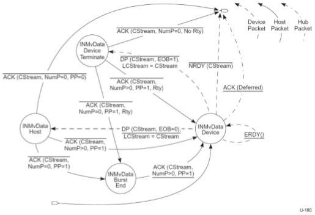

Revision 1.1
June 2022

- 280 -

Universal Serial Bus 3.2
Specification

Figure 8-44. Host IN Move Data State Machine (HIMDSM)

The Host IN Move Data State Machine (HIMDSM) is entered from the Start Stream or Idle states as described above. The entry into the HIMDSM immediately transitions to the INMvData Device state. The HIMDSM allows either the device to terminate the Move Data operation because it has exhausted its Function Data associated with a Stream or the host to terminate the Move Data operation because it has exhausted its Endpoint Buffer space associated with a Stream.

The HIMDSM always exits to the Idle state. The Retry (Rty=1) flag shall never be set in a packet that causes a HIMDSM exit. A Stream pipe remains in the Move Data state during packet retries.

Note: The Stream ID value shall be CStream for all packets exchanged in the Move Data state, except the INMvData Device substate ERDY transition. For the identified substates, if a Stream ID value other than CStream is detected while in the HIMDSM the host should halt the endpoint.

### 8.12.1.4.4.6 INMvData Device

This state is initially entered from the Start Stream state or the Idle state. In this state the host is waiting for a DP from the device or a rejection of a HIMD.

DP(CStream, EOB=0) – If the host receives a DP with EOB = 0, it shall copy the DP data to the Endpoint Buffer associated with the Stream and transition to the INMvData Host state. The DPP shall contain a CStream data payload. This transition occurs when the device returns IN data and has more Function Data to send. Upon transitioning to the INMvData Host state the host sets LCStream to the value of CStream. This action updates LCStream with the value of CStream if the device accepts a HIMD, i.e., LCStream records the last Stream that was of interest to the device.

Copyright © 2022 USB 3.0 Promoter Group. All rights reserved.