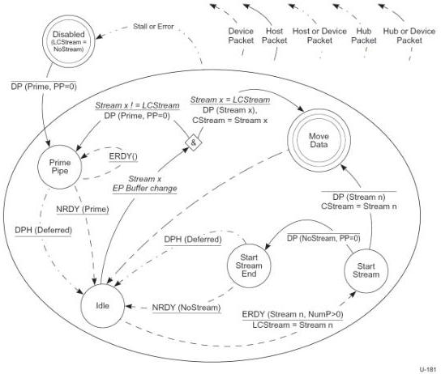

Revision 1.1
June 2022

- 283 -

Universal Serial Bus 3.2
Specification

Figure 8-45. Host OUT Stream Protocol State Machine (HOSPSM)

### 8.12.1.4.5.1 Disabled

After an endpoint is configured or receives a SetFeature(ENDPOINT_HALT) request, the pipe is in the Disabled state and LCStream is initialized to NoStream.

DP(Prime, PP=0) – When the initial Endpoint Data is assigned to the pipe by system software, the host shall send a zero-length DP with the Stream ID field set to Prime to the device, and transition the pipe to the Prime Pipe state. The DPP shall contain a zero-length data payload.

### 8.12.1.4.5.2 Prime Pipe

The Prime Pipe state informs the device that Endpoint Buffers have been assigned to one or more Streams. Note, this state is entered when the host transmits a DP(Prime) from the Disabled or the Idle state. If an error is detected in the DP data by the device, the device shall issue ACK(Prime, NumP>0, Rty) packet, retrying until a DP(Prime) is successfully received. The host may retransmit the DP(Prime) and shall remain in the Prime Pipe state until the device successfully receives the DP(Prime) and returns an NRDY(Prime), or the retries for the pipe are exhausted and the host halts the pipe. This case is not illustrated in the Figure above.

Copyright © 2022 USB 3.0 Promoter Group. All rights reserved.