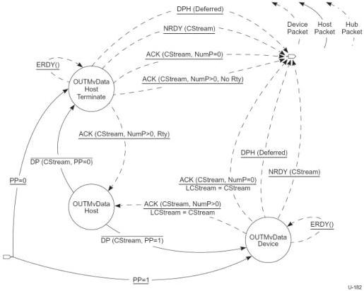

Revision 1.1
June 2022

- 286 -

Universal Serial Bus 3.2
Specification

Figure 8-46. Host OUT Move Data State Machine (HOMDSM)

The Host OUT Move Data State Machine (HOMDSM) is entered from the Start Stream or Idle states as described above. The entry into the HOMDSM immediately transitions to the OUTMvData Device state. The HOMDSM allows either the device to terminate the Move Data operation because it has exhausted its Function Buffer space associated with a Stream or the host to terminate the Move Data operation because it has exhausted its Endpoint Data associated with a Stream.

PP = 0 – Upon entry into the HOMDSM, if the host has only one packet of Endpoint Data available for the Stream then PP will equal 0 in the first DP sent to the Device, and it shall transition to the OUTMvData Device Terminate state.

PP = 1 – Upon entry into the HOMDSM, if the host has more than one packet of Endpoint Data available for the Stream then PP will equal 1 in the first DP sent to the Device, and it shall transition to the OUTMvData Device state.

The HOMDSM always exits to the Idle state. The Retry (Rty=1) flag shall never be set in a packet that causes a HOMDSM exit. A Stream pipe remains in the Move Data state during packet retries.

Note: The Stream ID value shall be CStream for all packets exchanged in the Move Data state, except the OUTMvData Device substate ERDY transition. For the identified substates, if a Stream ID value other than CStream is detected while in the HOMDSM the host should halt the endpoint.

Copyright © 2022 USB 3.0 Promoter Group. All rights reserved.