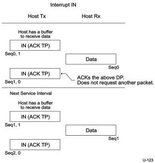
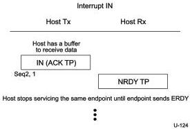

Revision 1.1
June 2022

- 294 -

Universal Serial Bus 3.2
Specification

endpoint. This notifies the host about the endpoint's readiness to transmit data again. Once the host receives the ERDY TP, it shall send an IN request (via an ACK TP) to the endpoint no later than twice the service interval as determined by the value of the bInterval field in the interrupt endpoint descriptor. An interrupt endpoint responds by returning either the DP (the sequence number of the packet being one more than the sequence number of the last successful data sent) or, should it be unable to return data, an NRDY or a STALL TP.

If a device receives a deferred interrupt IN TP, and the device needs to send interrupt IN data, the device shall respond with an ERDY TP and keep its link in U0 until it receives the subsequent interrupt transaction from the host, or until tPingTimeout (refer to Table 8-36) time elapses.

As in the case of Bulk transactions, the sequence number is continually incremented with each packet sent by an interrupt endpoint. When the sequence number reaches 31 it wraps around to zero.

Figure 8-49. Host Sends Interrupt IN Transaction in Each Service Interval

Figure 8-50. Host Stops Servicing Interrupt IN Transaction Once NRDY is Received

Copyright © 2022 USB 3.0 Promoter Group. All rights reserved.