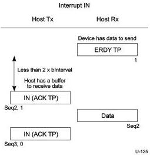
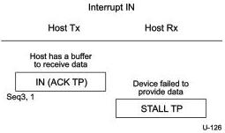

Revision 1.1

June 2022

- 295 -

Universal Serial Bus 3.2

Specification

Figure 8-51. Host Resumes IN Transaction after Device Sent ERDY

Figure 8-52. Endpoint Sends STALL TP

Copyright © 2022 USB 3.0 Promoter Group. All rights reserved.