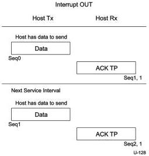
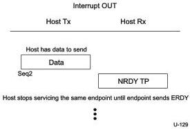

Revision 1.1
June 2022

- 297 -

Universal Serial Bus 3.2
Specification

When an endpoint receives data from the host, and it cannot receive data momentarily, it shall send an NRDY (or STALL in case of an internal endpoint or device error) TP to the host. The host shall not perform any more transactions to the endpoint in subsequent service intervals.

A host shall only resume interrupt transactions to an endpoint that responded with a flow control response after it receives an ERDY TP from that endpoint. This notifies the host about the endpoint's readiness to receive data again. Once the host receives an ERDY TP, the host shall transmit the data packet to the endpoint no later than twice the service interval as determined by the value of the bInterval field in the interrupt endpoint descriptor for that endpoint.

If a device receives a deferred interrupt OUT DPH, and the device needs to receive interrupt OUT data, the device shall respond with an ERDY TP and keep its link in U0 until it receives the subsequent interrupt transaction from the host, or until tPingTimeout (see Table 8-36) elapses.

As in the case of Bulk transactions, the sequence number is continually incremented with each packet sent by host. When the sequence number reaches 31 it wraps around to zero.

Figure 8-54. Host Sends Interrupt OUT Transaction in Each Service Interval

Figure 8-55. Host Stops Servicing Interrupt OUT Transaction Once NRDY is Received

Copyright © 2022 USB 3.0 Promoter Group. All rights reserved.