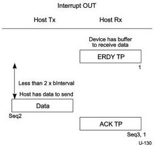
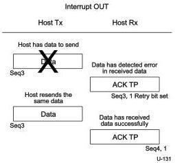
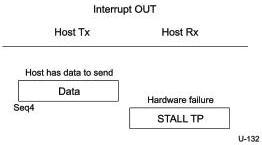

Revision 1.1
June 2022

- 298 -

Universal Serial Bus 3.2
Specification

Figure 8-56. Host Resumes Sending Interrupt OUT Transaction After Device Sent ERDY

Figure 8-57. Device Detects Error in Data and Host Resends Data

Note: In Figure 8-57 the host retries the data packet received with an error in the same service interval. It is not required to do so and may retry the transaction in the next service interval.

Figure 8-58. Endpoint Sends STALL TP

Copyright © 2022 USB 3.0 Promoter Group. All rights reserved.