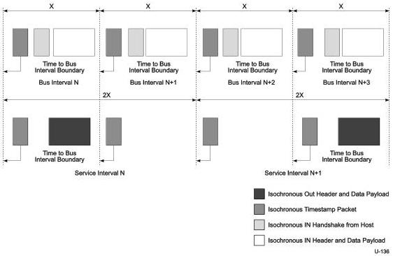

Revision 1.1
June 2022

- 300 -

Universal Serial Bus 3.2
Specification

Figure 8-59. Multiple Active Isochronous Endpoints with Aligned Service Interval Boundaries

### 8.12.6 Isochronous Transactions

The following sections define the Isochronous transaction protocols for SuperSpeed and SuperSpeedPlus devices. The SuperSpeedPlus protocol relaxes restrictions on how a host may schedule Isochronous transactions to/from a SuperSpeedPlus device and adds the ability to pipeline transaction requests to an endpoint in order to improve the efficiency of the bus.

#### 8.12.6.1 Enhanced SuperSpeed Isochronous Transactions

IN isochronous transactions are shown in Figure 8-60 and OUT isochronous transactions are shown in Figure 8-61. For INs, the host issues an ACK TP followed by a data phase in which the endpoint transmits data for INs. For OUTs, the host simply transmits data when there is data to be sent in the current service interval. Isochronous transactions do not support retry capability. The TT field shall be set to Isochronous by hosts and peripheral devices operating in SuperSpeedPlus mode; see Table 8-13.

Copyright © 2022 USB 3.0 Promoter Group. All rights reserved.