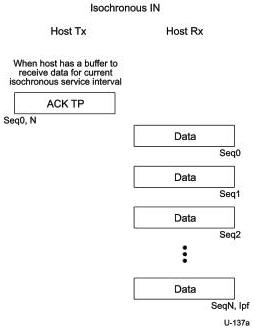
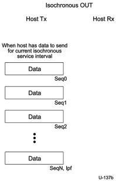

Revision 1.1
June 2022

- 301 -

Universal Serial Bus 3.2
Specification

Figure 8-60. Enhanced SuperSpeed Isochronous IN Transaction Format

Figure 8-61. Enhanced SuperSpeed Isochronous OUT Transaction Format

The first DP or ACK TP in each service interval shall start with the sequence number set to 0.

For isochronous transactions that include multiple data packets in a service interval the sequence number is increased by one for each subsequent DP. The DP after sequence number 31 uses a sequence number of zero.

Copyright © 2022 USB 3.0 Promoter Group. All rights reserved.