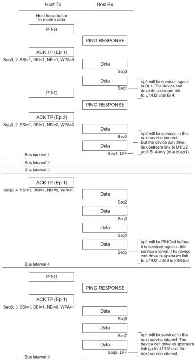

Revision 1.1

June 2022

- 308 -

Universal Serial Bus 3.2

Specification

Figure 8-66. Sample Smart Enhanced SuperSpeed Isochronous IN Transaction

Note: ep1/ep2 service interval 8 = Bus intervals, each expected to return 10 packets each.

U-172

Copyright © 2022 USB 3.0 Promoter Group. All rights reserved.