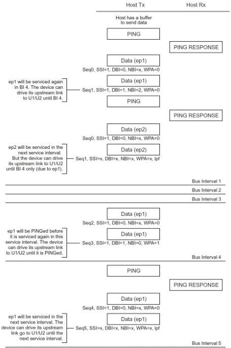

Revision 1.1

June 2022

- 309 -

Universal Serial Bus 3.2

Specification

Figure 8-67. Sample Smart Enhanced SuperSpeed Isochronous OUT Transaction

Note: ep1/ep2 service interval 8 = Bus Intervals, each expected to return 10 packets each.

U-173

### 8.12.6.2 Host Flexibility in Performing SuperSpeed Isochronous Transactions

A host targeting an endpoint on a SuperSpeed bus instance may transfer all the DPs to or from an endpoint in bursts of any size as long as the number of outstanding packets is less than or equal to the max burst size advertised by the endpoint in its descriptors.

Copyright © 2022 USB 3.0 Promoter Group. All rights reserved.