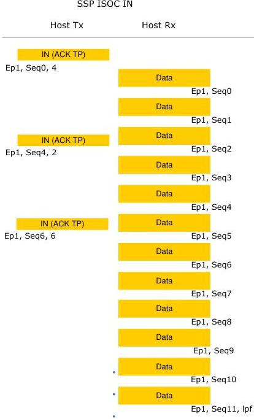

Revision 1.1
June 2022

- 311 -

Universal Serial Bus 3.2
Specification

**Figure 8-68. Sample Pipeline Isochronous IN Transactions**

**8.12.6.4 Host Flexibility in Performing SuperSpeedPlus Isochronous Transactions**

A host targeting an endpoint on a SuperSpeedPlus bus instance may transfer all the DPs to or from an endpoint in bursts of any size as long as the number of outstanding packets is less than or equal to the max burst size advertised by the endpoint in its descriptors.

Copyright © 2022 USB 3.0 Promoter Group. All rights reserved.