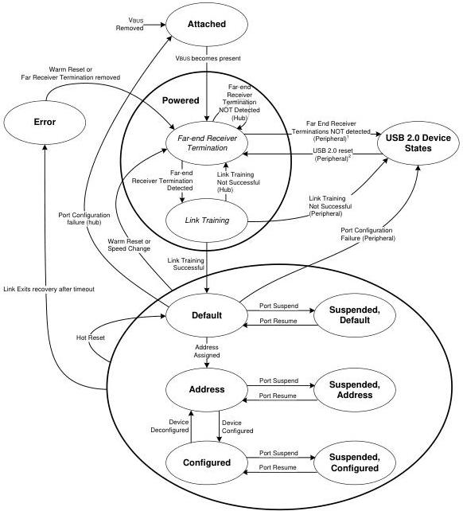

Revision 1.1
June 2022

- 318 -

Universal Serial Bus 3.2
Specification

Figure 9-1. Peripheral State Diagram and Hub State Diagram
(Enhanced SuperSpeed Portion Only)

¹ Refer to Note 2 in Figure 10-25 Peripheral Device Upstream Port State Machine.

² Refer to sections 10.16.2.6 and 10.16.2.7 for the conditions that cause this transition.

Figure 9-1 is a combined state diagram for both peripherals and hubs. Note that a USB Hub has two discrete state diagrams, one for the Enhanced SuperSpeed portion shown in Figure 9-1 and another for the non-SuperSpeed portion that may be found in Figure 9-1 in the USB 2.0 Specification.

Copyright © 2022 USB 3.0 Promoter Group. All rights reserved.