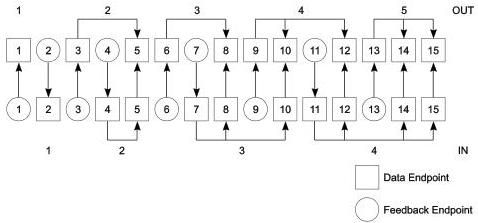

Revision 1.1
June 2022

- 367 -

Universal Serial Bus 3.2
Specification

Figure 9-8. Example of Feedback Endpoint Relationships

For high-speed bulk and control OUT endpoints, the bInterval field is only used for compliance purposes; the host controller is not required to change its behavior based on the value in this field.

### 9.6.7 SuperSpeed Endpoint Companion

This descriptor shall only be returned by Enhanced SuperSpeed devices that are operating at Gen X speed. Each endpoint described in an interface is followed by a SuperSpeed Endpoint Companion descriptor. This descriptor is returned as part of the configuration information returned by a GetDescriptor(Configuration) request and cannot be directly accessed with a GetDescriptor() or SetDescriptor() request. The Default Control Pipe does not have an Endpoint Companion descriptor. The Endpoint Companion descriptor shall immediately follow the endpoint descriptor it is associated with in the configuration information.

Copyright © 2022 USB 3.0 Promoter Group. All rights reserved.