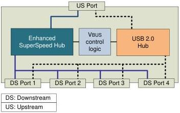

Revision 1.1
June 2022

- 372 -

Universal Serial Bus 3.2
Specification

## 10 Hub, Host Downstream Port, and Device Upstream Port Specification

This chapter describes the architectural requirements for a hub that supports both Enhanced SuperSpeed and USB 2.0 and is referred to as a "USB hub". The chapter also describes differences between functional requirements for a host downstream port and a hub downstream port as well as differences between a peripheral upstream port and a hub upstream port. The chapter contains the description of the Enhanced SuperSpeed hub. An Enhanced SuperSpeed hub supports all Gen X x Y speeds.

This chapter includes descriptions of the SuperSpeed sub-blocks (the SuperSpeed repeater/forwarder and the SuperSpeed Hub Controller) as well as the SuperSpeedPlus sub-blocks (the SuperSpeedPlus Upstream Controller, the SuperSpeedPlus Downstream Controller and the SuperSpeedPlus Hub Controller). This chapter also describes the hub's operation for error recovery, reset, suspend/resume, hub request behavior, and hub descriptors. The USB 2.0 hub sub-block is described in the Universal Serial Bus Specification, Revision 2.0.

The hub specification chapter along with the Universal Serial Bus Specification, Revision 2.0 supply the information needed for an implementer to design a hub that conforms to this revision of the USB specification.

### 10.1 Hub Feature Summary

Hubs provide the electrical interface between USB devices and the host. Hubs are directly responsible for supporting many of the attributes that make USB user friendly and hide its complexity from the user. Listed below are the major aspects of USB functionality that hubs support:

- Connectivity behavior
- Power management
- Device connect/disconnect detection
- Bus fault detection and recovery
- Enhanced SuperSpeed and USB 2.0 (high-speed, full-speed, and low-speed) device support

Figure 10-1. USB Hub Architecture

Copyright © 2022 USB 3.0 Promoter Group. All rights reserved.