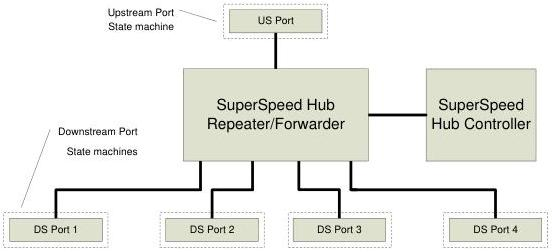

Revision 1.1
June 2022

- 373 -

Universal Serial Bus 3.2
Specification

When a USB hub connects on its upstream facing port at Gen 1x1 speed, it shall operate (and be referred to) as a SuperSpeed hub (including operating its downstream ports at no higher than Gen 1x1 speed).

When a USB hub connects on its upstream facing port at a speed above Gen 1x1 speed, it shall operate (and be referred to) as a SuperSpeedPlus hub.

When the hub upstream facing port is attached to an electrical environment that is only operating at high-speed or full-speed, then Enhanced SuperSpeed connectivity is not available to devices attached to downstream facing ports.

Figure 10-1 shows a high level block diagram of a four port USB hub and the locations of its upstream and downstream facing ports. A USB hub is the logical combination of two hubs: a USB 2.0 hub and an Enhanced SuperSpeed hub. Each hub operates independently on a separate data bus. Typically, the only signal shared logic between them is to control VBUS. If either the USB 2.0 hub or Enhanced SuperSpeed hub controllers requires a downstream port to be powered, power is turned on for the port. A USB hub connects on both interfaces upstream whenever possible. All exposed downstream ports on a USB hub shall support both Enhanced SuperSpeed and USB 2.0 connections. Host controller ports may have different requirements.

Figure 10-2 shows the SuperSpeed portion of a USB hub consisting of a Hub Repeater/Forwarder section and a Hub Controller section.

The USB 2.0 portion of a USB hub shall meet all requirements of the USB 2.0 Specification unless specific exceptions are noted.

The SuperSpeed Hub Repeater/Forwarder is responsible for connectivity setup and tear-down. It also supports exception handling, such as bus fault detection and recovery and connect/disconnect detect. The SuperSpeed Hub Controller provides the mechanism for host-to-hub communication. Hub-specific status and control commands permit the host to configure a hub and to monitor and control its individual downstream facing ports.

Figure 10-2. SuperSpeed Portion of the USB Hub Architecture

As shown in Figure 10-3, the SuperSpeedPlus hub portion consists of three functional components: the SuperSpeedPlus Upstream Controller, the SuperSpeedPlus Downstream

Copyright © 2022 USB 3.0 Promoter Group. All rights reserved.