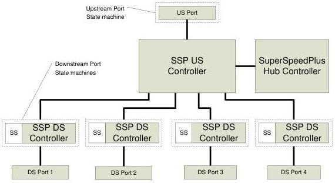

Revision 1.1
June 2022

- 374 -

Universal Serial Bus 3.2
Specification

Controller and the SuperSpeedPlus Hub Controller. All subsequent references in this specification are to components of the Enhanced SuperSpeed hub unless otherwise noted.

The SuperSpeedPlus Upstream (SSP US) Controller is responsible for the behavior of the upstream port, buffering for packets being received from the upstream link, buffering and arbitrating packets waiting to be transmitted on the upstream link, and for routing packets to the appropriate downstream port's Downstream Controller (or to the hub controller).

The SuperSpeedPlus Downstream (SSP DS) Controller is responsible for the behavior of the downstream port, buffering for packets being received from the downstream link, buffering and arbitrating packets waiting to be transmitted on the downstream link and for routing packets to the Upstream Controller.

The SuperSpeedPlus Hub Controller provides the same mechanism for host-to-hub communication that the SuperSpeed Hub Controller does.

Figure 10-3. SuperSpeedPlus Portion of the Hub Architecture

Unlike USB peripheral devices, a USB hub connects upstream on both the Enhanced SuperSpeed bus and USB 2.0 bus. Connections may be enabled or disabled under the control of system software for a USB hub's downstream ports. If a USB hub upstream port is not connected on either USB 2.0 bus or Enhanced SuperSpeed bus, the hub does not provide power to the downstream ports unless it supports power applications. Refer to Section 10.3.1.1 for a detailed discussion on when a hub is allowed to remove VBUS from a downstream facing port. This specification allows self-powered and bus-powered hubs. A bus-powered hub is one that uses Standard USB power. A self-powered hub draws power from one of the following:

- an external source via a non-USB connector (e.g. barrel jack)
- USB PD (either from an upstream port or a downstream port on the hub)
- USB Type-C current (from an upstream port).

Copyright © 2022 USB 3.0 Promoter Group. All rights reserved.