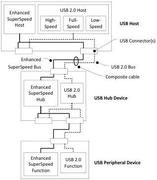

Revision 1.1
June 2022

- 375 -

Universal Serial Bus 3.2
Specification

The following sections present the typical flow for connection management in various types of systems for the simple topology shown in Figure 10-4 when the host system is first powered on.

Note: These connection examples outline cases where the system operates as expected. The handling of error cases are specified later in this chapter.

Figure 10-4. Simple USB Topology

### 10.1.1 Connecting to an Enhanced SuperSpeed Capable Host

When the host is powered off, the hub does not provide power to its downstream ports unless the hub supports power applications (refer to Section 10.3.1.1).

When a hub is connected to a powered port and it detects Enhanced SuperSpeed connectivity, by default the following is the typical sequence of events:

- The upstream facing port will train at the fastest speed supported by its link partner as defined in the link chapter.
- Simultaneously, the hub powers its downstream ports and trains each link at the fastest speed supported by its link partner.
- If a downstream port trained at a higher speed than the upstream port then the downstream port shall retrain at a speed no faster than the upstream port.
- Hub connects both as an Enhanced SuperSpeed hub device and as a high-speed hub device.
- Host system begins hub enumeration at high-speed and Gen X speed.
- Host system begins device enumeration at Gen X speed.

Copyright © 2022 USB 3.0 Promoter Group. All rights reserved.