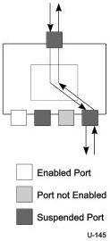

Revision 1.1
June 2022

- 379 -

Universal Serial Bus 3.2
Specification

If a downstream facing port is enabled (i.e., in a state where it can transmit and receive packets) and the hub detects the start of a packet on that port, the hub shall begin to store the packet header. The hub shall route the valid header packet received on the downstream port to the upstream port, but not to any other downstream facing ports. This means that when a device or a hub transmits a packet upstream, only those hubs in a direct line between the transmitting device and the host will see the packet.

All packets except Isochronous Timestamp Packets (ITP) are unicast in the downstream direction; hubs operate using a direct routing model. This means that when the host or hub transmits a packet downstream, only those hubs in a direct line between the host and recipient device will see the packet.

### 10.1.4 Resume Connectivity

Hubs exhibit different connectivity behaviors for upstream- and downstream-directed resume signaling. A hub does not propagate resume signaling from its upstream facing port to any of its downstream facing ports unless a downstream facing port is suspended and has received resume signaling since it was suspended. Figure 10-7 illustrates hub upstream and downstream resume connectivity.

Figure 10-7. Resume Connectivity

If a hub upstream port is suspended and the hub detects resume signaling from a suspended downstream facing port, the hub propagates that signaling upstream and does not reflect that signaling to any of the downstream facing ports (including the downstream port that originated resume signaling). If a hub upstream port is not suspended and the hub detects resume signaling from a suspended downstream facing port, the hub reflects resume signaling to the downstream port. Note that software shall not initiate a transition to U3 on the upstream port of a hub unless it has already initiated transitions to U3 on all enabled downstream ports. A detailed discussion of resume connectivity appears in Section 10.10.

### 10.1.5 Hub Fault Recovery Mechanisms

Hubs are the essential USB component for establishing connectivity between the host and other devices. It is vital that any connectivity faults be prevented if possible and detected in the unlikely event they occur.

Copyright © 2022 USB 3.0 Promoter Group. All rights reserved.