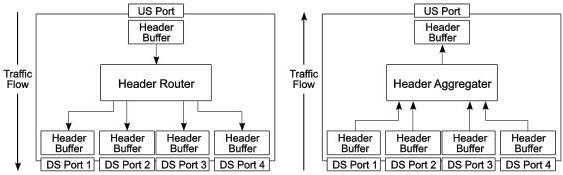

Revision 1.1
June 2022

- 380 -

Universal Serial Bus 3.2
Specification

Hubs must also be able to detect and recover from lost or corrupted packets that are addressed to the Hub Controller. Because the Hub Controller is, in fact, another USB device, it shall adhere to the same rules as other USB devices, as described in Chapter 8.

### 10.1.6 Hub Buffer Architecture

The buffering behaviors of an Enhanced SuperSpeed hub operating in SuperSpeed mode or in SuperSpeedPlus mode are different. Section 10.1.6.1 summarizes the buffering behavior of the hub when operating in SuperSpeed mode. Section 10.1.6.2 summarizes the buffering and arbitration behavior of the hub when operating in SuperSpeedPlus mode.

#### 10.1.6.1 SuperSpeed Hub Buffer Architecture

The SuperSpeed hub has header packet buffers associated with its upstream and downstream ports. It also has data packet payload (DPP) buffers for upstream and downstream data flows. See Section 10.7 or Section 10.7.4 for more details.

##### 10.1.6.1.1 SuperSpeed Hub Header Packet Buffer Architecture

Figure 10-8 shows the logical representation of a typical header packet buffer implementation for a SuperSpeed hub. Logically, a SuperSpeed hub has separate header packet buffers associated with each port for both upstream and downstream traffic. When a SuperSpeed hub receives a header packet on its upstream port, it routes the header packet to the appropriate downstream header packet buffer for transmission (unless the header packet is for the hub). When the SuperSpeed hub receives a non-LMP header packet on a downstream port, it routes the header packet to the upstream port header packet buffer for transmission. Header packets are kept in the SuperSpeed hub header packet buffers after transmission until link level acknowledgement (LGOOD_n) for the header packet is received. This allows the SuperSpeed hub to retry the header packets if necessary to ensure that header packets are received correctly at the link level. The header packet buffers also allow a SuperSpeed hub to store the header packets until they can be forwarded when the header packet is directed to a downstream link that is a low power link state. SuperSpeed hubs store the header packet and deliver it once the link becomes active.

Figure 10-8. Typical SuperSpeed Hub Header Packet Buffer Architecture

Copyright © 2022 USB 3.0 Promoter Group. All rights reserved.