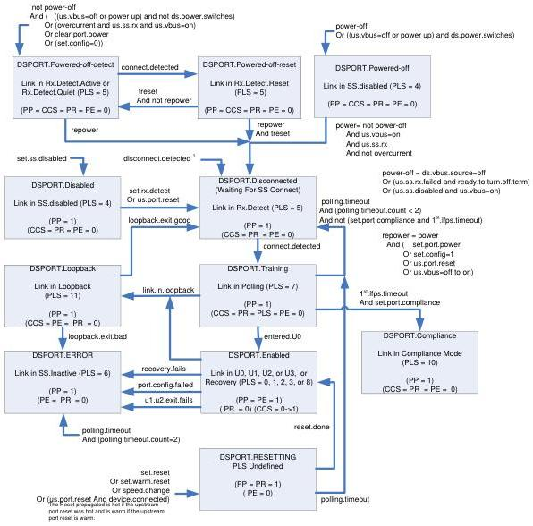

Revision 1.1

June 2022

- 383 -

Universal Serial Bus 3.2

Specification

# NOTE

For the root hub, the signals from the upstream facing port state machines are implementation dependent.

Figure 10-10. Downstream Facing Hub Port State Machine

Port Status Field:

Notation Field Name

PP PORT_POWER

CCS PORT_CONNECTION

PR PORT_RESET

PLS PORT_LINK_STATE

PE PORT_ENABLE

Note:

Clear Port Feature (PORT_ENABLED) and Set Port Feature (PORT_ENABLED) are not used for SS Ports

1 This direct transition may only occur from a DSPORT state whose link is in the SS.Inactive, Rx.Detect.Active (during DSPORT.RESETTING), U1, U2, or U3 state.

Copyright © 2022 USB 3.0 Promoter Group. All rights reserved.