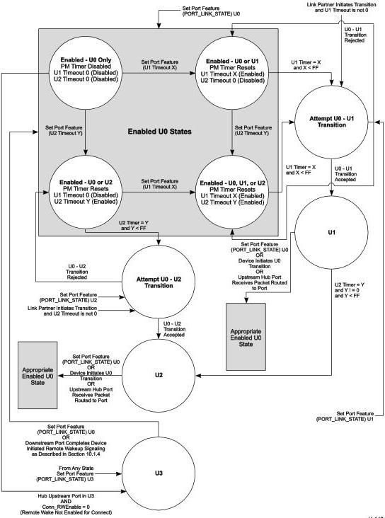

Revision 1.1

June 2022

- 392 -

Universal Serial Bus 3.2

Specification

Figure 10-11. Downstream Facing Hub Port Power Management State Machine

U-149

Copyright © 2022 USB 3.0 Promoter Group. All rights reserved.