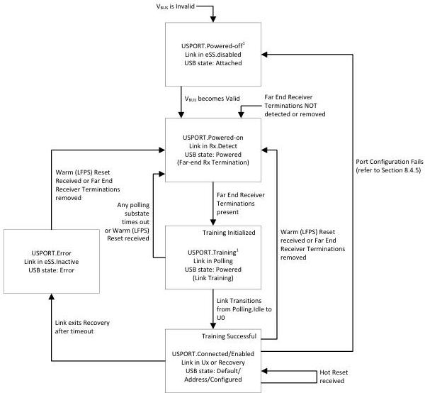

Revision 1.1
June 2022

- 397 -

Universal Serial Bus 3.2
Specification

Figure 10-12. Upstream Facing Hub Port State Machine

¹ If Port Configuration fails, the port shall transition to the USPORT-Powered-off state with the link in eSS.Disabled state and USB Device in the Attached state. VBUS may still be present on the upstream port. VBUS must be toggled to transition to the USPORT-Powered state.

### 10.5.1 Upstream Facing Port State Descriptions

Refer to Figure 9-1 for hub USB states.

#### 10.5.1.1 USPORT-Powered-off

The USPORT-Powered-off state is the default state for an upstream facing port.

A port shall transition into this state if any of the following situations occur:

- From any state when VBUS is invalid.
- From any state if far-end receiver terminations are not detected.
- From the USPORT.Connected/Enabled state if the Port Configuration process fails.

Copyright © 2022 USB 3.0 Promoter Group. All rights reserved.